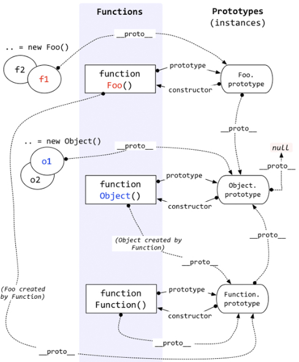

# 一张图看清楚原型链

 

 ## 概括
 每个函数都有prototype属性，除了Function.prototype.bind()，该属性指向原型

 每个对象都有__proto__属性，指向创建该对象的构造函数的原型。

 对象可以通过__proto__来寻找不属于该对象的属性，__proto__将对象连接起来组成了原型链
 ## 理解
 原型是一个特殊的对象，它继承于Object

 Object是JS内部定义好的一个构造函数，可以创建JS对象，当然我们也可以自己定义构造函数，比如function Foo(){}，也可以用这个构造函数去创建对象（var f =new Foo()），但是自己定义的构造函数创建的对象f，Foo.prototype相当于它爸爸，因为它的__proto__指向Foo.prototype,Object相当于它爷爷，因为它爸爸（Foo.prototype）的__proto__指向Object.prototype.

 ## 继承 
 把父类的原型挂到子类的原型上面