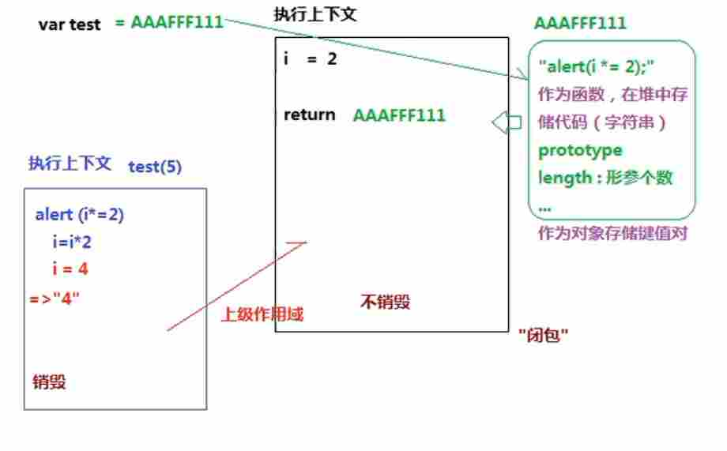
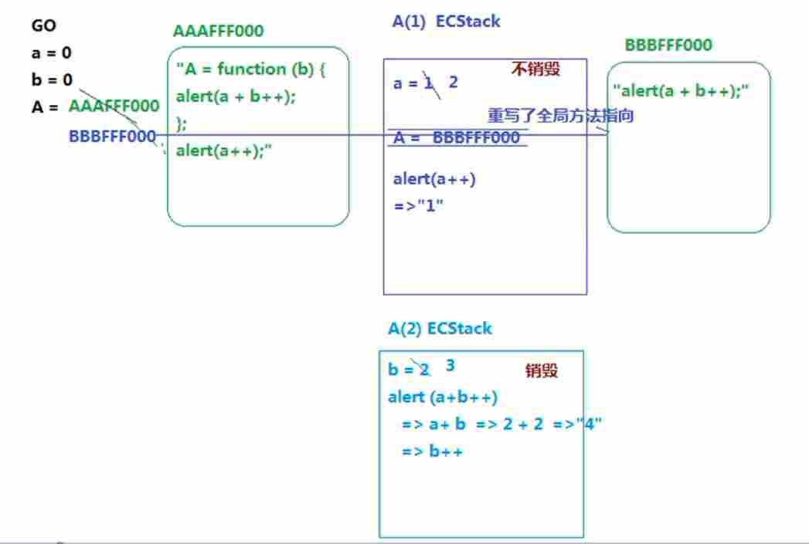

# 什么是闭包？
自己的理解：在一个作用域内部使用了一个另一个作用域里面的值，那么这个作用域将形成了一个闭包
## 第一题
``` js
var test=(function(i){ // i属于外层函数作用域里面的值
    return function(){
        alert(i*=2); // 这里使用了外部外部作用域里面的值，因此该函数形成了闭包，但是需要注意的时候，alert输出的都是字符串，所以答案是'4'
    }
})(2);
test(5);
```
### 解析：
图解



## 第二题
``` js
var a = 0, b = 0;
function A(a) {
    A = function (b) {
        alert(a + b++);
    }
    alert(a++);
}
A(1);
A(2);
```
### 解析：
图解

